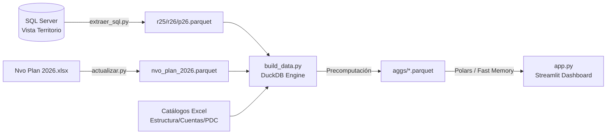

# Manual de Actualización y Mantenimiento de Datos
### Dashboard Vista Territorio — Grupo Elektra

> [!IMPORTANT]
> **Público Objetivo**: Administradores de Sistemas, Planeación Financiera y TI.  
> **Frecuencia Recomendada**: Semanal (los jueves tras el corte contable) o bajo demanda.  
> **Tiempo Estimado de Ejecución**: ~8 a 15 minutos (proceso en segundo plano).

---

## 📖 Contenido

1. [Arquitectura del Pipeline de Datos](#1-arquitectura-del-pipeline-de-datos)
2. [Actualización Automática (Desde la Interfaz)](#2-actualización-automática-desde-la-interfaz)
3. [Actualización Manual (Vía Consola PowerShell)](#3-actualización-manual-vía-consola-powershell)
4. [Estructura de Scripts del Pipeline](#4-estructura-de-scripts-del-pipeline)
5. [Mapeo y Mantenimiento de Catálogos Excel](#5-mapeo-y-mantenimiento-de-catálogos-excel)
6. [Resolución de Problemas y Diagnóstico](#6-resolución-de-problemas-y-diagnóstico)

---

## 1. Arquitectura del Pipeline de Datos

El flujo de actualización semanal extrae los datos de origen desde SQL Server, los consolida con los ajustes del Nuevo Plan y aplica la deduplicación de catálogos mediante DuckDB y Polars.



---

## 2. Actualización Automática (Desde la Interfaz)

El dashboard cuenta con un monitor en segundo plano que consulta SQL Server cada 5 minutos.

1. Abre el dashboard en el navegador (`http://localhost:8502`).
2. Si se detectan nuevos registros en SQL Server, aparecerá una notificación amarilla en la barra lateral:
   > ⚠️ **Hay datos nuevos en SQL Server**
3. Haz clic en el botón **`Actualizar`**.
4. El sistema iniciará la extracción y compilación en segundo plano sin interrumpir el uso del dashboard.
5. Al concluir (~10 min), el dashboard se recargará automáticamente con la información actualizada.

---

## 3. Actualización Manual (Vía Consola PowerShell)

Si prefieres ejecutar el proceso directamente desde la línea de comandos:

### Actualización Estándar (Solo si detecta cambios):
```powershell
cd "E:\Usuarios\112665\Downloads\Dashboard Vista Territorio - copia"
python actualizar.py
```

### Actualización Forzada (Sobrescribe y recalcula todo):
```powershell
python actualizar.py --force
```

### Verificación de Novedades (Check silencioso):
```powershell
python actualizar.py --check
# Retorna exit status: 0 = Hay datos nuevos | 1 = No hay cambios | 2 = Error de conexión
```

### Re-agregación Rápida (Solo recomputa jerarquías en 5 segundos):
Si modificaste únicamente `app.py` o reglas de agrupación visuales sin cambiar los datos crudos:
```powershell
python build_data.py --aggs-only
```

---

## 4. Estructura de Scripts del Pipeline

| Script | Descripción y Función | Tiempo Promedio |
|---|---|---:|
| `extraer_sql.py` | Se conecta a SQL Server (`Vista Territorio`), extrae las series `Real 2025`, `Real 2026` y `Plan 2026`, y genera los archivos parquet de origen. | 2 - 5 min |
| `actualizar.py` | Orquestador principal. Monitorea `Downloads/Nvo Plan 2026.xlsx`, coordina la extracción, publica el progreso en `estado.json` y registra bitácoras en `actualizacion.log`. | — |
| `build_data.py` | Motor de transformación DuckDB. Deduplica catálogos, realiza los joins 1:1, consolida las 95M de filas y genera la carpeta precomputada `aggs/*.parquet`. | 5 - 10 min |
| `semana.py` | Calcula el calendario EKT de 53 semanas y prorrateo diario para cortes mensuales. | Instantáneo |

---

## 5. Mapeo y Mantenimiento de Catálogos Excel

Los archivos de catálogo viven en la raíz del proyecto y deben mantenerse en formato Excel (`.xlsx`):

### 1. `Catálogo de estructura.xlsx`
Define la jerarquía territorial y de agrupación:
* `cat_Agrupa1`: Rubro macro (*Gastos de Operación*, *Servicios Personales*, etc.).
* `cat_Direccion_Division`: Nombre de la División.
* `cat_Subdireccion_Territorio`: Nombre del Territorio.
* `cat_Subdireccion_Zona`: Nombre de la Zona.
* `cat_Subdireccion_Region`: Nombre de la Región.
* `cat_PDC`: Nombre y ID del Punto de Contacto.

### 2. `Catálogo grupo cuentas.xlsx`
Establece la agrupación contable:
* `Grupo de Cuentas` $\rightarrow$ `Cuentas` $\rightarrow$ `PosPre`.

### 3. `Puntos de contacto.xlsx`
Mapeo homologado de IDs oficiales de PDC y nombres de sucursales/tiendas.

---

## 6. Resolución de Problemas y Diagnóstico

### Error: "No se pudo consultar SQL Server (¿VPN?)"
* **Causa**: Falta de conexión a la red corporativa o VPN desactivada.
* **Solución**: Revisa la conexión a la VPN e intenta nuevamente. Las credenciales de base de datos se configuran en el archivo `.env`.

### Error: "Permission denied: app.py" o bloqueo de archivos
* **Causa**: Proceso de Streamlit ejecutándose en segundo plano con bloqueo de lectura.
* **Solución**: Cierra las ventanas activas de terminal y ejecuta `streamlit run app.py --server.port 8502`.

### Verificación de Bitácoras:
Consulta el archivo `actualizacion.log` para revisar los detalles del último procesamiento.

---
*Manual técnico de actualización para el Dashboard Vista Territorio — Grupo Elektra.*
