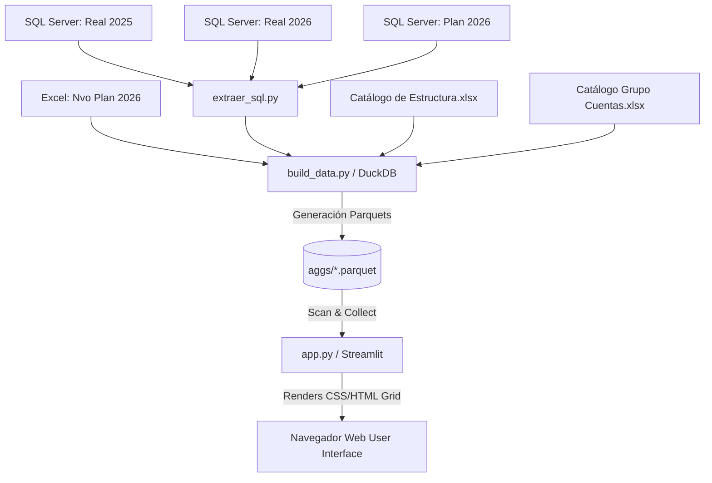

# Manual Técnico de Arquitectura y Desarrollo
### Dashboard Vista Territorio — Grupo Elektra

> [!IMPORTANT]
> **Público Objetivo**: Desarrolladores Python, Data Engineers y Arquitectos de Software.  
> **Stack Principal**: `Python 3.9+`, `Streamlit`, `Polars`, `DuckDB`, `Plotly`, `Parquet`.

---

## 1. Arquitectura del Sistema

El sistema utiliza una arquitectura **Offline Pre-computation + In-Memory Fast Rendering**:



---

## 2. Jerarquía de Datos y Deduplicación

Para evitar el problema de inflado de montos (~5%) detectado en versiones anteriores por duplicados en los joins de catálogos Excel, `build_data.py` deduplica las llaves antes de agrupar en DuckDB.

### Mapeos Jerárquicos Principales (`app.py`):
```python
PARENTS = {
    "division": ["cat_Agrupa1"],
    "territorio": ["cat_Agrupa1", "cat_Direccion_Division"],
    "zona": ["cat_Agrupa1", "cat_Direccion_Division", "cat_Subdireccion_Territorio"],
    "region": ["cat_Agrupa1", "cat_Direccion_Division", "cat_Subdireccion_Territorio", "cat_Subdireccion_Zona"],
    "pdc": ["cat_Agrupa1", "cat_Grupo_de_Cuentas", "cat_Direccion_Division", "cat_Subdireccion_Territorio",
            "cat_Subdireccion_Zona", "cat_Subdireccion_Region"],
    "grupo_cuentas": ["cat_Agrupa1"],
    "cuentas": ["cat_Agrupa1", "cat_Grupo_de_Cuentas"],
    "pospre": ["cat_Agrupa1", "cat_Grupo_de_Cuentas", "cat_Cuentas"],
}

HIER_TERR = ["agrupa1", "division", "territorio", "zona", "region", "pdc"]
HIER_CTA = ["agrupa1", "grupo_cuentas", "cuentas", "pospre"]
```

---

## 3. Componentes de UI y Algoritmos de Render

### 3.1 `fmt_tabla` y Formato Contable
La función `fmt_tabla` devuelve un objeto `pandas.io.formats.style.Styler` con:
* Resaltado amarillo `#fffde7` en la columna `Real 2026`.
* Encabezados formateados con `set_table_styles` (`font-weight: 800 !important`).
* Regla contable para números positivos (rojo) y abonos (carbón).
* Variaciones en texto sin pastilla de fondo (rojo oscuro `#78281f`, verde oscuro `#145a32`).

### 3.2 Árbol Lazy (`arbol_perezoso`)
Diseñado para la navegación en fuentes con millones de registros (ej. `pdc_pospre.parquet` con 17.75M de combinaciones):
* **Carga Bajo Demanda**: No construye el HTML completo de entrada. Solo evalúa la función `_nivel_arbol_perezoso` al hacer clic en el botón del nodo.
* **Active Branch Highlighting**: Las filas abiertas reciben la clase `.vt-open`, aplicando `background: #eef4fc` y `border-left: 5px solid #1a73e8`.

---

## 4. Pruebas Automatizadas y Verificación

El proyecto incluye dos suites de pruebas para garantizar integridad contable y estructural:

### 1. `_test_smoke.py`
Verifica la renderización de las 12 secciones del dashboard y la integridad de totales globales.
```powershell
python _test_smoke.py
```

### 2. `tests/test_drill.py`
Valida la conciliación matemática exacta en los 5 niveles del drill-down territorial y contable (padre == suma de hijos).
```powershell
python tests/test_drill.py
```

---
*Manual Técnico — Dirección de Planeación Financiera.*
