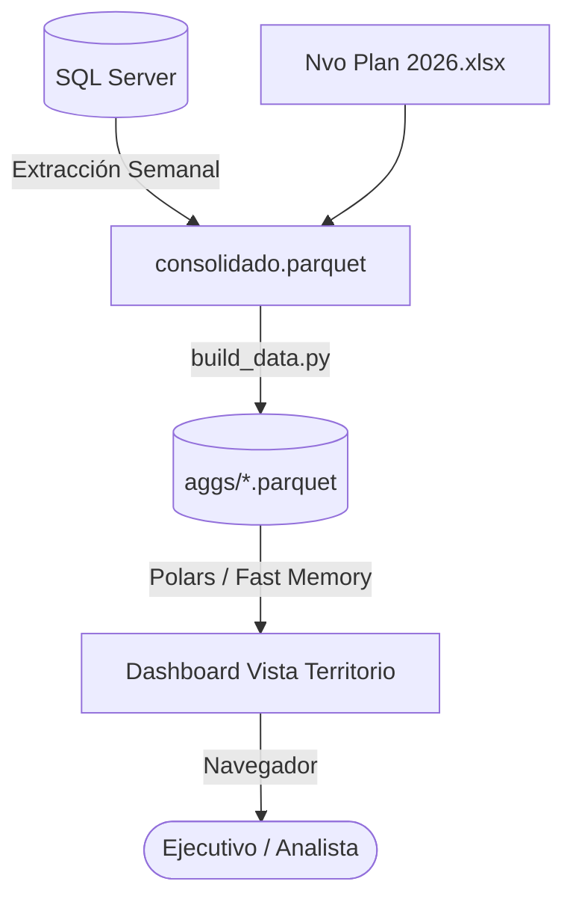

# Manual de Usuario — Dashboard Vista Territorio
### Grupo Elektra · Dirección de Planeación Financiera

> [!IMPORTANT]
> **Versión del Manual**: 2.5 (Edición 2026)  
> **Ámbito**: Operativo, Ejecutivo y Financiero  
> **Sistema**: Dashboard Vista Territorio (`Streamlit` + `Polars` + `DuckDB`)  
> **Acceso**: `http://localhost:8502`

---

## 📖 Contenido

1. [Introducción y Objetivos](#1-introducción-y-objetivos)
2. [Estructura y Navegación de la Interfaz](#2-estructura-y-navegación-de-la-interfaz)
3. [Convenciones Visuales y Sistema de Diseño](#3-convenciones-visuales-y-sistema-de-diseño)
4. [Estructura de Jerarquías y Drill-Down](#4-estructura-de-jerarquías-y-drill-down)
5. [Guía Detallada por Pestaña](#5-guía-detallada-por-pestaña)
   - [5.1 Resumen Executive](#51-resumen-executive)
   - [5.2 Div / Terr (Jerarquías)](#52-div--terr-jerarquías)
   - [5.3 Detalle Cuenta (Drill-Down Cuentas / PosPre)](#53-detalle-cuenta-drill-down-cuentas--pospre)
   - [5.4 Detalle PDC](#54-detalle-pdc)
   - [5.5 PDC & Calor](#55-pdc--calor)
   - [5.6 Plan + Real](#56-plan--real)
   - [5.7 Temporalidad](#57-temporalidad)
   - [5.8 Cierres](#58-cierres)
   - [5.9 Trimestres](#59-trimestres)
   - [5.10 Riesgos & Oportunidades](#510-riesgos--oportunidades)
   - [5.11 Comentarios](#511-comentarios)
6. [Descarga y Exportación de Información](#6-descarga-y-exportación-de-información)
7. [Preguntas Frecuentes y Soporte](#7-preguntas-frecuentes-y-soporte)

---

## 1. Introducción y Objetivos

El **Dashboard Vista Territorio** es la herramienta ejecutiva oficial de Planeación Financiera de Grupo Elektra para el monitoreo, control presupuestal y análisis del **Gasto Red**. 

Permite comparar en tiempo real y a cualquier nivel de desglose operacional las siguientes series financieras:
* **Real 2025**: Gasto real ejecutado en el ejercicio anterior.
* **Plan 2026**: Presupuesto original aprobado para el ejercicio 2026.
* **Nvo Plan 2026**: Recompensación/Ajuste de presupuesto aprobado durante el año.
* **Real 2026**: Gasto real registrado en la contabilidad hasta la semana de corte.
* **Forecast Cierre**: Proyección al cierre anual estimada.



---

## 2. Estructura y Navegación de la Interfaz

La interfaz se divide en 3 zonas funcionales principales:

```
┌─────────────────────────────────────────────────────────────────────────────┐
│ 1. BARRA LATERAL (Sidebar): Filtros de Rango Semanal / Mes / Trimestre     │
├─────────────────────────────────────────────────────────────────────────────┤
│ 2. ENCABEZADO Y SELECTOR DE PESTAÑAS (Segmented Control - 11 Pestañas)      │
├─────────────────────────────────────────────────────────────────────────────┤
│ 3. ÁREA DE TRABAJO PRINCIPAL: Tablas, Árboles Interactivos y Gráficas       │
└─────────────────────────────────────────────────────────────────────────────┘
```

### Barra Lateral (Sidebar)
* **Modo de Rango**: Elige entre evaluar por *Semanas*, *Meses* o *Trimestres (Q1-Q4)*.
* **Acumulado vs Individual**: 
  * *Acumulado*: Suma desde la semana 1 hasta la semana seleccionada.
  * *Individual*: Analiza únicamente la semana o período seleccionado.
* **Filtros por Estructura**: Filtra todo el dashboard por *Dirección/División*, *Subdirección/Territorio*, *Formato* o *Grupo de Cuentas*.

---

## 3. Convenciones Visuales y Sistema de Diseño

El sistema aplica estándares visuales internacionales de contabilidad y diseño ejecutivo:

### 🟡 Columna Real 2026 Resaltada
* **Encabezados**: Título en negrita (`Real 2026` y `% Tot`) sobre un **amarillo suave de realce** (`#fff59d`).
* **Celdas**: Fondo amarillo marfil (`#fffde7`) con texto en negrita.

> [!NOTE]
> **Regla Contable de Colores**:
> - **Gasto Positivo (Devengado)**: Texto en **rojo** (`#c0392b`).
> - **Abonos / Créditos / Cero**: Texto en **carbón oscuro** (`#2b2b2b`).

### 🔴🟢 Variaciones Sin Fondo (Texto Directo)
Las variaciones (`vs Nvo Plan`, `vs Plan`, `vs AA`, `vs Forecast`) no utilizan pastillas rellenas de color. Muestran directamente el valor numérico en texto oscuro:
* **Gasto Excedido (Sobre Presupuesto)**: Texto **rojo oscuro** (`#78281f`, casi negro).
* **Ahorro / Sub-ejercicio**: Texto **verde oscuro** (`#145a32`, casi negro).

### 🌳 Resaltado de Ruta Activa en Árboles (`Active Branch Highlight`)
Al expandir cualquier nodo o rama en los árboles interactivos:
* **Fila Seleccionada / Abierta**: Se resalta con un **fondo azul claro** (`#eef4fc`), una **franja izquierda azul brillante** (`border-left: 5px solid #1a73e8`), texto en **negrita azul** y el ícono `▼`.
* **Seguimiento de Ruta**: Al profundizar 3 o 4 niveles, **toda la cadena de ramas padre abiertas permanece azul**, permitiéndote saber exactamente en qué punto de la estructura te encuentras.

```
▼ Agrupa 1: Gastos de Operación                    [Fondo Azul Clavado #eef4fc]
   │
   ├─► ▼ Grupo de Cuentas: Servicios Personales   [Fondo Azul Clavado #eef4fc]
   │      │
   │      └─► ▼ Cuenta: Sueldos y Salarios BASE   [Fondo Azul Clavado #eef4fc]
   │             │
   │             └─► ▫ PosPre: 50001001           [Fila Hoja Blanco]
```

### 🔤 Encabezados de Tablas en Negrita
Todos los títulos de columnas en tablas estándar y árboles están estilizados en **negrita fuerte (`font-weight: 800`)** para garantizar legibilidad inmediata.

---

## 4. Estructura de Jerarquías y Drill-Down

El sistema soporta el orden jerárquico estricto establecido por Planeación Financiera:

### Jerarquía Territorial Completa:
$$\text{Agrupa 1} \longrightarrow \text{División} \longrightarrow \text{Territorio} \longrightarrow \text{Zona} \longrightarrow \text{Región} \longrightarrow \text{PDC}$$

### Jerarquía Contable Completa:
$$\text{Agrupa 1} \longrightarrow \text{Grupo de Cuentas} \longrightarrow \text{Cuentas} \longrightarrow \text{PosPre}$$

---

## 5. Guía Detallada por Pestaña

### 5.1 Resumen Executive
Muestra la radiografía general de la Red de Grupo Elektra.

* **Tarjetas de KPI**:
  - *Real 2026*: Monto acumulado y % de cumplimiento del plan.
  - *Real 2025*: Monto acumulado y % YoY.
  - *Plan 2026 & Nvo Plan*: Montos aprobados y variaciones en MDP.
  - *Forecast Cierre*: Proyección al cierre del año.
* **KPI Operativo**: Muestra exclusivamente la **Mayor variación vs Plan** por Grupo de Cuentas.
* **Tabla Resumen**: Muestra únicamente los **Grupos de Cuentas** (sin sub-niveles ni duplicados).
* **Gráficas Comparativas**: Muestra las barras de Reales y las líneas de Plan, Nvo Plan y la **Línea de Forecast Cierre** (color naranja).

---

### 5.2 Div / Terr (Jerarquías)
Filtra y explora las cifras territoriales o contables.

* **Filtro Agrupa 1**: Selector superior para enfocar el análisis en un rubro específico (*Gastos de Operación*, *Servicios Personales*, etc.) o ver `(Todas)`.
* **Conmutador de Jerarquía**: Cambia entre la vista *Territorial* o *Contable*.
* **Árbol Jerárquico**:
  - **Nivel 0**: `Agrupa 1`
  - **Nivel 1**: `División`
  - **Nivel 2**: `Territorio`
  - **Nivel 3**: `Zona`
  - **Nivel 4**: `Región`
  - **Nivel 5**: `PDC` (Punto de Contacto con ID y Nombre)

---

### 5.3 Detalle Cuenta (Drill-Down Cuentas / PosPre)
Diseñado para la revisión puntual de partidas contables y PosPre.

* **Buscadores Inteligentes**:
  - *Buscar cuenta*: Escribe el nombre o clave de la cuenta.
  - *Filtrar por Agrupa 1*: Selecciona la categoría principal.
  - *Buscar PosPre*: Busca por nombre o ID de Posición Presupuestal.
* **4 Botones de Vista**:
  1. `División`: `Agrupa 1` $\rightarrow$ `Grupo de Cuentas` $\rightarrow$ `Cuentas` $\rightarrow$ `División` $\rightarrow$ `PosPre`
  2. `Territorio`: `Agrupa 1` $\rightarrow$ `Grupo de Cuentas` $\rightarrow$ `Cuentas` $\rightarrow$ `División` $\rightarrow$ `Territorio` $\rightarrow$ `PosPre`
  3. `Zona`: `Agrupa 1` $\rightarrow$ `Grupo de Cuentas` $\rightarrow$ `Cuentas` $\rightarrow$ `División` $\rightarrow$ `Territorio` $\rightarrow$ `Zona` $\rightarrow$ `PosPre`
  4. `Región`: `Agrupa 1` $\rightarrow$ `Grupo de Cuentas` $\rightarrow$ `Cuentas` $\rightarrow$ `División` $\rightarrow$ `Territorio` $\rightarrow$ `Zona` $\rightarrow$ `Región` $\rightarrow$ `PosPre`

> [!TIP]
> **Rendimiento Ultrarrápido (`Lazy Tree`)**: Esta pestaña utiliza un algoritmo de carga perezosa (`arbol_perezoso`). Solo calcula los datos del nodo que decides abrir, permitiendo navegar entre millones de registros sin congelar la pantalla.

---

### 5.4 Detalle PDC
Catálogo interactivo con los 4,678 Puntos de Contacto. Muestra su ID oficial, nombre homologado, división, territorio, zona y región.

---

### 5.5 PDC & Calor
Análisis de dispersión y mapas de variaciones para identificar las sucursales/tiendas con mayores desviaciones presupuestales (Top 25 Sobre Presupuesto / Top 25 Bajo Presupuesto).

---

### 5.6 Plan + Real
Matriz comparativa completa de semanas ejecutadas vs semanas futuras, incluyendo la columna y variaciones de **Forecast Cierre**.

---

### 5.7 Temporalidad
Evolución del gasto con tres granularidades, elegibles con el botón **Granularidad** (Semanal / Mensual / Trimestral):

* **Semanal**: semanas 1 a 53, tabla y gráficas semana a semana.
* **Mensual**: agregado por mes con el **Calendario Financiero EKT** (prorrateo diario proporcional para semanas que cruzan dos meses).
* **Trimestral**: agregado en Q1–Q4. Además de Real 2025 / Plan 2026 / Real 2026, Vs AA y Vs Plan, incluye la columna **Forecast** (proyección de cierre de año): Real 2026 del trimestre + Plan 2026 de las semanas aún no ejecutadas del año completo, con su variación **Vs Forecast** contra el Plan. El Forecast es el mismo para todos los trimestres en la fila TOTAL (no se suma trimestre a trimestre, ya que representa el cierre de año, no un acumulado parcial).

Incluye buscador de PDC / ID Centro de Costos para filtrar la tabla sin tocar el filtro global, y botón de descarga a CSV en cada vista.

---

### 5.8 Cierres
Análisis detallado de CECOs por estatus operacional (*Cierres*, *Transformaciones*, *Aperturas*) y su impacto presupuestal.

---

### 5.9 Trimestres
Comparativo trimestral (Q1, Q2, Q3, Q4) marcando automáticamente si un trimestre está parcialmente ejecutado.

---

### 5.10 Riesgos & Oportunidades
Matriz automatizada de alertas que identifica desviaciones relevantes a nivel Global, por División y por Grupo de Cuentas.

---

### 5.11 Comentarios
Bitácora colaborativa donde los analistas pueden guardar notas explicativas por tema, división o semana.

---

## 6. Descarga y Exportación de Información

Cada tabla y árbol cuenta con un botón directo de **Descargar CSV**.

> [!IMPORTANT]
> **Formato de Números Completos**:  
> Al descargar cualquier archivo CSV, las cifras se exportan con su **número completo en pesos exactos con decimales** (ej. `15492834.50`), **nunca abreviados ni redondeados**, facilitando su pegado y formulación directa en Excel.

---

## 7. Preguntas Frecuentes y Soporte

**Q: ¿Por qué la columna Real 2026 muestra ceros a partir de la semana 28?**  
*R: El corte oficial de gasto real contable en la base de datos es la Semana 27 de 2026. Las semanas posteriores utilizan el Plan o Forecast para las proyecciones.*

**Q: ¿Por qué se ven ceros en variaciones de algunas cuentas?**  
*R: Si una cuenta no registró presupuesto o gasto en el período seleccionado, las variaciones muestran `$0.00` y `0.0%`.*

**Q: ¿Quién puede actualizar los datos en el sistema?**  
*R: Solo los usuarios con rol `admin` o `supervisor` visualizan el botón de **Actualizar** en la barra lateral.*

---
*Documentación oficial mantenida por el equipo de Planeación Financiera — Grupo Elektra.*
